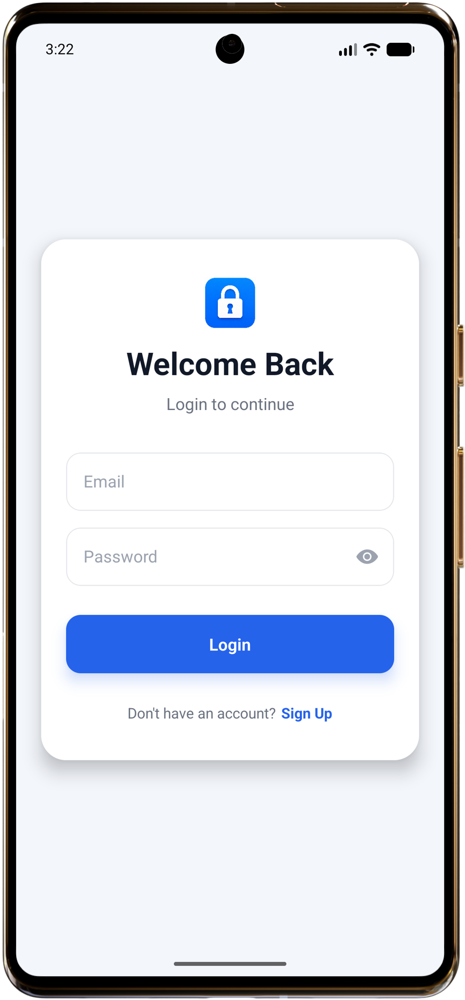
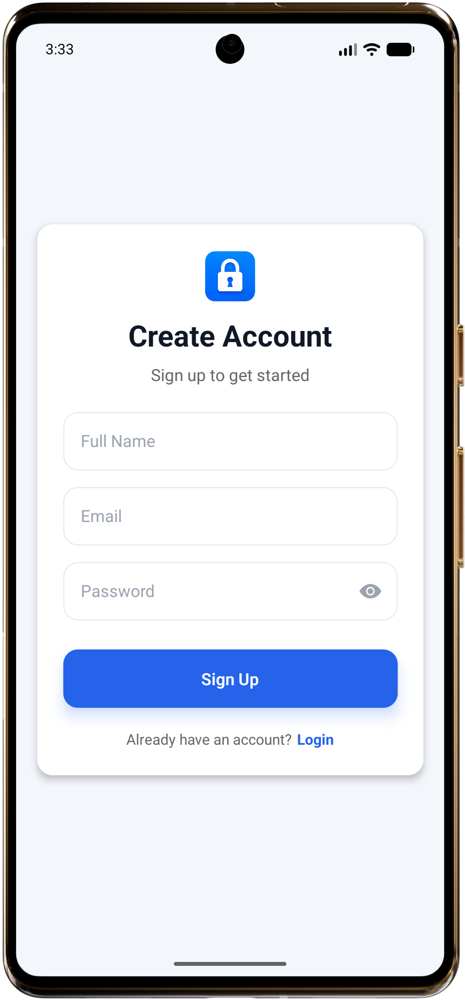
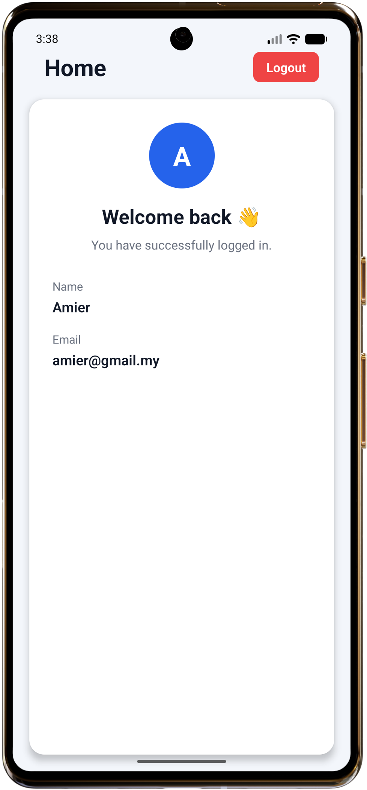
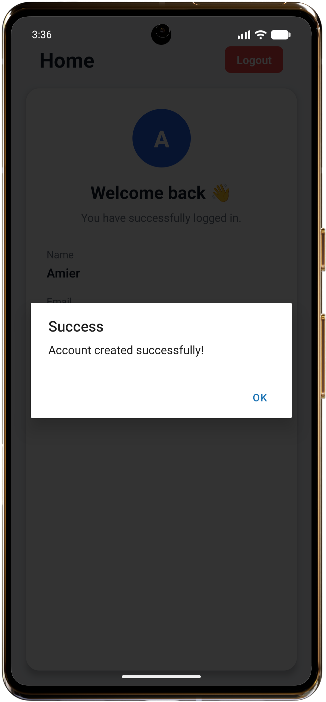
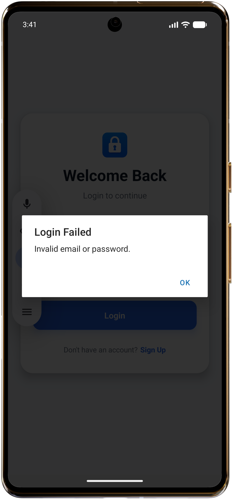
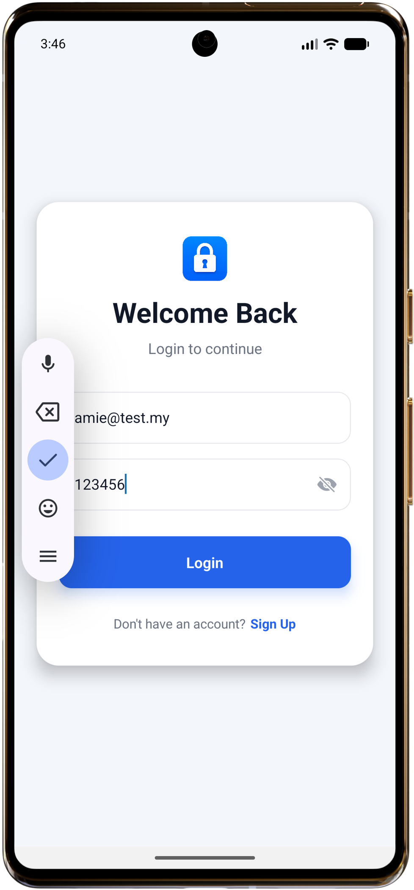

# AuthFlow - User Authentication App

A modern React Native authentication application built with Expo, demonstrating a complete authentication flow using React Context API, React Navigation, and AsyncStorage.

---

## Features

- User Registration (Signup)
- User Login
- User Logout
- Global Authentication State using React Context API
- Authentication Persistence with AsyncStorage
- Password Visibility Toggle
- Input Validation
- Modern and Responsive User Interface
- Reusable UI Components
- Protected Navigation Flow

---

## Tech Stack

- React Native
- Expo SDK 54
- React Context API
- React Navigation
- AsyncStorage
- JavaScript (ES6+)

---

## Project Structure

```
src
├── components
│   ├── CustomButton.js
│   ├── CustomInput.js
│   └── LoadingScreen.js
│
├── context
│   └── AuthContext.js
│
├── navigation
│   └── AppNavigator.js
│
├── screens
│   ├── LoginScreen.js
│   ├── SignupScreen.js
│   └── HomeScreen.js
│
├── services
│   └── authService.js
│
├── storage
│   └── authStorage.js
│
├── styles
│   └── colors.js
│
└── utils
    └── validation.js
```

---

## Architecture

The application follows a layered architecture to improve maintainability and separation of concerns.

### Context Layer

Responsible for managing the global authentication state throughout the application.

- User session
- Login
- Signup
- Logout

### Service Layer

Contains authentication business logic.

- User registration
- Login verification
- Duplicate email checking

### Storage Layer

Responsible for interacting with AsyncStorage.

- Store users
- Retrieve users
- Persist logged-in user
- Remove logged-in user

### Presentation Layer

Contains reusable UI components and application screens.

---

## Authentication Flow

```
Application Launch
        │
        ▼
Load Current User
        │
        ▼
User Exists?
   │           │
 Yes          No
   │           │
   ▼           ▼
 Home       Login
               │
               ▼
           Signup
```

---

## Installation

Clone the repository

```bash
git clone https://github.com/<your-username>/authflow.git
```

Navigate to the project

```bash
cd authflow
```

Install dependencies

```bash
npm install
```

Start the development server

```bash
npx expo start
```

Scan the QR code using Expo Go (SDK 54).

---

## Screens

- Login Screen
- Signup Screen
- Home Screen

---

## Screenshots

### Login



### Signup



### Home



### Signup Success Message



### Login Invalid Credential



### Password Visibility Toggle



---

## Implemented Requirements

- React Context API
- Login
- Signup
- Logout
- Home Screen
- Form Validation
- React Navigation
- AsyncStorage Persistence
- Password Visibility Toggle
- Reusable Components

---

## Future Improvements

If this project were extended into a production application, the following improvements would be considered:

- Backend authentication API
- JWT Authentication
- Secure token storage using Expo SecureStore
- Password hashing
- Forgot Password
- Email Verification
- Unit Testing
- Dark Mode
- Biometric Authentication

---

## Notes

For demonstration purposes, user accounts are stored locally using AsyncStorage.

In a production environment, authentication would be handled by a secure backend service, passwords would never be stored in plain text, and sensitive credentials would be managed using secure storage mechanisms.

---

## Author

Muhammad Khoirul Amier

React Native Developer